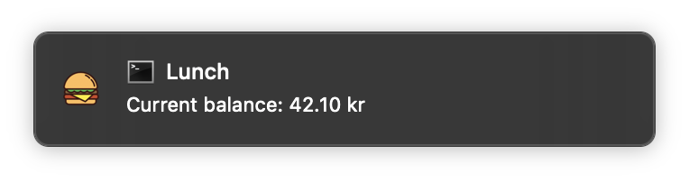

# dnb-lunch-balance
Some simple python scripts to get current balance in the DNB cantina at Bjørvika Oslo

The script will use the microsmycentral portal to fetch the current balance of the user, and push it as a osx notification.

Username/email is stored in username.txt file, password stored in OSX keychain.

## Prerequisites
Currently python 2.7, let's make this 3.7 asap. Otherwise, requests.txt and terminal-notifier as indicated by `installer.sh`

## Example commands:
If the program can't fint username.txt in the current folder, it will ask for a new username and password:

    python main.py
    Add dnb email: john.doe@dnb.no
    Add password:

A notification will show up:

If you need to reset the username or password:

    python main.py reset
    Add dnb email: john.doe@dnb.no
    Add password:
    